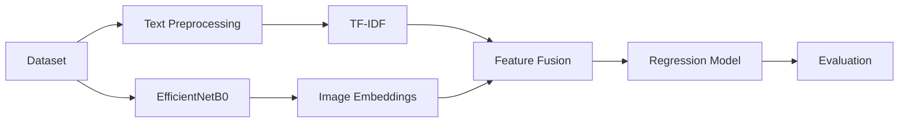

# Multimodal Product Price Predictor

[](https://www.python.org/)
[](https://www.tensorflow.org/)
[](https://scikit-learn.org/)
[](https://jupyter.org/)

## 1. Project Overview

Predict product prices using multiple modalities:

- Product text
- Product images
- Structured product information

This project explores whether multimodal learning improves price prediction compared to a text-only baseline.

## 🚀 Development Timeline

| Phase | Status | Description |
|-------|--------|-------------|
| Phase 1 | ✅ Completed | Data preprocessing, exploratory data analysis, TF-IDF text baseline |
| Phase 2 | ✅ Completed | EfficientNetB0 image feature extraction and notebook refactoring |
| Phase 3 | ✅ Completed | Multimodal feature fusion, model training, evaluation and comparison |
| Phase 4 | ⏳ Planned | Model optimization and feature engineering |
| Phase 5 | ⏳ Planned | Streamlit web application |
| Phase 6 | ⏳ Planned | Deployment and final polishing |

```
Phase 1 ✅
      ↓
Phase 2 ✅
      ↓
Phase 3 ✅
      ↓
Phase 4 ⏳
      ↓
Phase 5 ⏳
      ↓
Phase 6 ⏳
```

## 2. Features

- Text preprocessing
- TF-IDF feature extraction
- EfficientNetB0 image embeddings
- Multimodal feature fusion
- Regression model training
- Model evaluation
- Performance comparison
- Modular notebook workflow

## 3. Project Structure

```
app/
data/
notebooks/
    01_data_understanding.ipynb
    02_eda.ipynb
    03_text_baseline.ipynb
    04_image_feature_extraction.ipynb
    05_multimodal_model.ipynb
src/
README.md
requirements.txt
```

## 4. Workflow



## 5. Technologies Used

- Python
- Pandas
- NumPy
- Scikit-learn
- TensorFlow
- EfficientNetB0
- XGBoost
- Matplotlib
- Jupyter Notebook

## 6. Notebook Pipeline

- `01_data_understanding.ipynb` — Dataset understanding
- `02_eda.ipynb` — Exploratory Data Analysis
- `03_text_baseline.ipynb` — Text baseline
- `04_image_feature_extraction.ipynb` — Image feature extraction
- `05_multimodal_model.ipynb` — Multimodal model

## 7. Results

| Model         | MAE     | RMSE    | R²      |
|--------------|---------|---------|---------|
| Text Baseline | 14.0354 | 33.3573 | 0.0858 |
| Multimodal    | 14.0555 | 33.1946 | 0.0947 |

## 8. Key Findings

- Text features contained most of the pricing signal.
- Image embeddings provided only marginal improvements.
- Multimodal learning does not always outperform unimodal approaches.
- Future work includes better feature engineering and model tuning.

## 9. Future Improvements

- Hyperparameter tuning
- Structured feature extraction
- Better multimodal fusion
- Streamlit deployment
- Model explainability (SHAP)

## 10. Installation

```bash
git clone https://github.com/your-username/Multimodal-Product-Price-Predictor.git
cd Multimodal-Product-Price-Predictor
pip install -r requirements.txt
```

## 11. Run

Open the notebooks in Jupyter and run them in order:

1. `01_data_understanding.ipynb`
2. `02_eda.ipynb`
3. `03_text_baseline.ipynb`
4. `04_image_feature_extraction.ipynb`
5. `05_multimodal_model.ipynb`

## 12. License

MIT License
