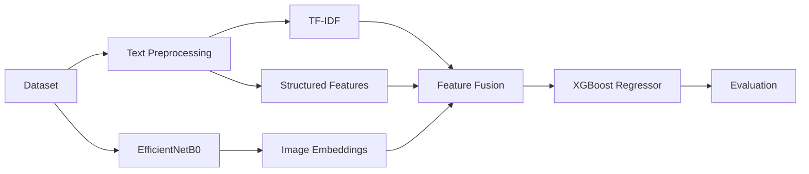

# Multimodal Product Price Predictor

[](https://www.python.org/)
[](https://www.tensorflow.org/)
[](https://scikit-learn.org/)
[](https://jupyter.org/)

## 1. Project Overview

Predict product prices using **multiple modalities**:

* 📝 Product text
* 🖼️ Product images
* 📦 Structured product information

This project investigates whether combining textual, visual, and structured features can improve product price prediction compared to a traditional text-only approach.

---

## 🚀 Development Timeline

| Phase   | Status      | Description                                                            |
| ------- | ----------- | ---------------------------------------------------------------------- |
| Phase 1 | ✅ Completed | Data preprocessing, exploratory data analysis and TF-IDF text baseline |
| Phase 2 | ✅ Completed | EfficientNetB0 image feature extraction                                |
| Phase 3 | ✅ Completed | Multimodal feature fusion, model training and evaluation               |
| Phase 4 | ✅ Completed | Model optimization and structured feature engineering                  |
| Phase 5 | ⏳ Planned   | Streamlit web application                                              |
| Phase 6 | ⏳ Planned   | Cloud deployment and project polishing                                 |

---

## 2. Features

* Text preprocessing
* TF-IDF feature extraction
* EfficientNetB0 image embeddings
* Structured feature engineering
* Multimodal feature fusion
* XGBoost regression
* Model optimization
* Performance comparison
* Modular notebook workflow

---

## 3. Project Structure

```text
app/
data/
notebooks/
    01_data_understanding.ipynb
    02_eda.ipynb
    03_text_baseline.ipynb
    04_image_feature_extraction.ipynb
    05_multimodal_model.ipynb
    06_model_optimization.ipynb
src/
README.md
requirements.txt
```

---

## 4. Workflow



---

## 5. Technologies Used

* Python
* Pandas
* NumPy
* Scikit-learn
* TensorFlow / Keras
* EfficientNetB0
* XGBoost
* Matplotlib
* SciPy
* Jupyter Notebook

---

## 6. Notebook Pipeline

| Notebook                            | Description                                     |
| ----------------------------------- | ----------------------------------------------- |
| `01_data_understanding.ipynb`       | Dataset understanding                           |
| `02_eda.ipynb`                      | Exploratory Data Analysis                       |
| `03_text_baseline.ipynb`            | TF-IDF text baseline model                      |
| `04_image_feature_extraction.ipynb` | EfficientNetB0 image embeddings                 |
| `05_multimodal_model.ipynb`         | Text + Image multimodal model                   |
| `06_model_optimization.ipynb`       | Structured features and optimized XGBoost model |

---

## 7. Results

| Model                |         MAE |        RMSE |         R² |
| -------------------- | ----------: | ----------: | ---------: |
| Text Baseline        | **14.0354** | **33.3573** | **0.0858** |
| Multimodal           | **14.0555** | **33.1946** | **0.0947** |
| Optimized Multimodal | **13.8603** | **33.2399** | **0.0922** |

---

## 8. Key Findings

* Product text contains the strongest pricing signal.
* EfficientNetB0 image embeddings provide complementary information.
* Structured features (weight, pack size, etc.) further improve prediction quality.
* Combining multiple feature types creates a robust end-to-end multimodal pipeline.
* The optimized model achieved the lowest MAE among all experiments.

---

## 9. Future Improvements

* Deploy using Streamlit
* Cloud deployment (Streamlit Community Cloud / Hugging Face Spaces)
* Transformer-based text embeddings (Sentence-BERT)
* Vision Transformer (ViT) or CLIP image embeddings
* SHAP-based model explainability
* Hyperparameter optimization using Optuna

---

## 10. Installation

```bash
git clone https://github.com/Urvity03/Multimodal-Product-Price-Predictor.git

cd Multimodal-Product-Price-Predictor

pip install -r requirements.txt
```

---

## 11. Run

Run the notebooks in the following order:

1. `01_data_understanding.ipynb`
2. `02_eda.ipynb`
3. `03_text_baseline.ipynb`
4. `04_image_feature_extraction.ipynb`
5. `05_multimodal_model.ipynb`
6. `06_model_optimization.ipynb`

---

## 12. License

This project is licensed under the **MIT License**.
