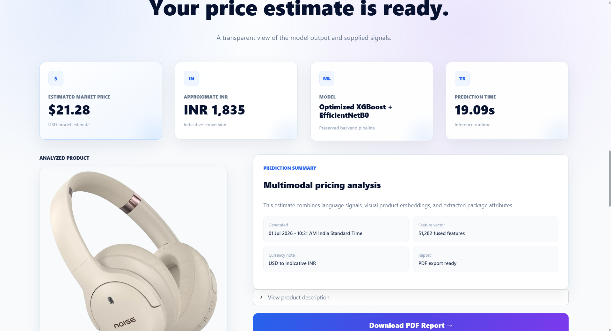

# PriceVision AI

<p align="center">
  <strong>AI-Powered Multimodal Product Price Estimation</strong>
</p>

<p align="center">
Estimate product prices using product descriptions, images, and structured attributes through a multimodal machine learning pipeline.
</p>

<p align="center">


</p>

---

## Overview

PriceVision AI is a multimodal machine learning application that estimates product prices by combining Natural Language Processing (NLP), Computer Vision, and structured product attributes.

The application analyzes:

- Product descriptions
- Product images
- Structured product attributes

to generate an **Estimated Market Price (USD)** along with an approximate **INR conversion** and a downloadable **PDF report**.

---

## Key Highlights

- Multimodal AI price estimation
- TF-IDF text feature extraction (50,000 features)
- EfficientNetB0 image embeddings (1,280 features)
- Structured feature engineering
- 51,282-dimensional feature fusion
- Optimized XGBoost regression model
- Estimated Market Price (USD)
- Approximate INR conversion
- PDF report generation
- Responsive Streamlit interface
- Cached inference for improved performance

---

# Application Preview

### Home Page


---

### Prediction Workspace


---

### Results Dashboard



---

## Model Architecture

```text
                 Product Description
                          │
                          ▼
                 TF-IDF (50,000 Features)

Product Image ─────► EfficientNetB0 (1,280 Features)

Structured Attributes
(weight, quantity, pack size)
                          │
                          ▼
              Feature Fusion (51,282 Features)
                          │
                          ▼
                 Optimized XGBoost Model
                          │
                          ▼
              Estimated Market Price (USD)
                          │
                          ▼
                Approximate INR Conversion
```

---

## Project Structure

```text
PriceVision-AI
│
├── app/                 Streamlit application
├── backend/             Model loading and inference
├── components/          Reusable UI components
├── assets/              Images and static assets
├── data/                Runtime model files
├── notebooks/           Model development notebooks
├── screenshots/         README images
├── src/                 Experimental utilities
├── styles/              Global styling
├── requirements.txt
└── README.md
```

---

## Technology Stack

| Category | Technology |
|-----------|------------|
| Language | Python |
| Frontend | Streamlit |
| NLP | TF-IDF |
| Computer Vision | TensorFlow, EfficientNetB0 |
| Machine Learning | XGBoost |
| Image Processing | Pillow |
| Data Processing | Pandas, NumPy |
| Utilities | Scikit-learn, Joblib |

---

## Installation

Clone the repository.

```bash
git clone https://github.com/Urvity03/Multimodal-Product-Price-Predictor.git
```

Navigate to the project.

```bash
cd Multimodal-Product-Price-Predictor
```

Install the dependencies.

```bash
pip install -r requirements.txt
```

Run the application.

```bash
streamlit run app/app.py
```

> **Note:** The first prediction may take longer while the TF-IDF vocabulary and EfficientNetB0 resources initialize. Subsequent predictions reuse cached resources for faster inference.

---

## Model

| Component | Purpose |
|-----------|---------|
| TF-IDF | Product description features |
| EfficientNetB0 | Image feature extraction |
| Structured Feature Engineering | Weight and pack-size extraction |
| XGBoost | Final multimodal regression model |

The deployed application reconstructs the TF-IDF vocabulary deterministically from the original ordered corpus to preserve compatibility with the trained XGBoost model. The prediction model itself is **not retrained during inference**.

---

## Prediction Scope

This model was trained on a broad e-commerce dataset.

Predictions are generally more reliable for products similar to those represented in the training data. Estimates for premium, newly released, or rare products may be less accurate.

The deployed model was trained on approximately **5,000 curated e-commerce products** combining product descriptions, images, and structured attributes.

---

## Performance

| Metric | Value |
|--------|------:|
| Model | Optimized Multimodal XGBoost |
| Mean Absolute Error (MAE) | **13.86** |
| Output | Estimated Market Price (USD) |

Predictions are intended as intelligent market estimates rather than exact retail prices.

---

## Future Improvements

- Category-specific pricing models
- Brand-aware feature engineering
- Live exchange-rate integration
- Multi-currency support
- Confidence calibration
- Cloud deployment
- Training on larger multimodal datasets

---

## Developer

**Urvi Tyagi**

B.Tech – Artificial Intelligence & Machine Learning

- GitHub: https://github.com/Urvity03
- LinkedIn: https://www.linkedin.com/in/urvi-tyagi-17b302286/

Project Repository:

https://github.com/Urvity03/Multimodal-Product-Price-Predictor

---

## Contributing

Contributions, suggestions, and feedback are welcome. Feel free to open an issue or submit a pull request.

---

## License

This project is licensed under the MIT License.

---

⭐ If you found this project useful, consider giving it a star on GitHub.